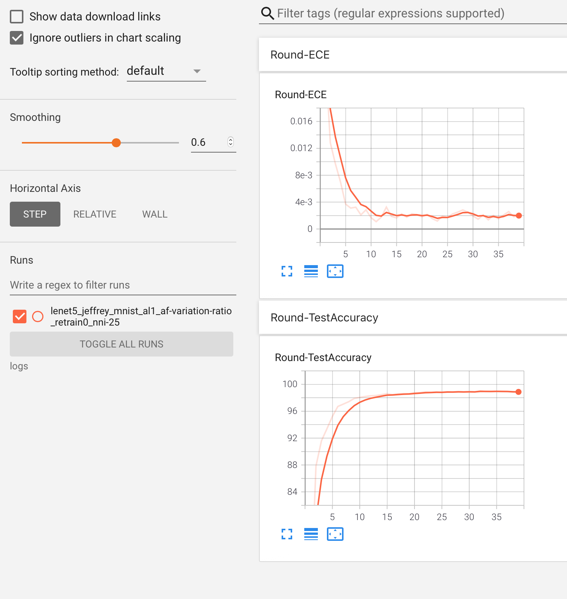

## Active Learning Using Bayesian Neural Network

### Prepare the Environment

Create your virtual python environment using pip and install the packages from ```requirements.txt```

Enable Tensorboard Visualization with the command ```tensorboard --logdir=logs```

### Folders
The program creates the following folders under the same execution directory

1. trained_weights: After each round, the trained NN are stored in this folder.
2. logs: The program uses this folder to write intermediate logs to visualize in tensorboard.
3. results - used to hold the final results.

###  A Note on Bayesian Layers
Note that there are two popular ways of inference when it comes to Bayesian Neural Networks: (a) MCMC sampling-based approach proposed by Blundell et. al. titled ["Weight uncertainty in neural network"](http://proceedings.mlr.press/v37/blundell15.pdf) and a closed form-based approach proposed by [Louizos et. al. titled "Bayesian Compression for Deep Learning"](https://arxiv.org/pdf/1705.08665.pdf). We use the later to define our Bayesian layers and all experiments in our paper was performed using this approach. The program does allow using Blundell's approach of BNNs (set using the argument ```--modeltype```), but we found this approach to yield inconsistent results and it needs further testing.
### How to run

**Examples:**
1. Bayesian active learining on a simple lenet5 model on MNIST dataset.
Here, we are running the lenet 5 model for 40 rounds, at each round we add 100 new samples to the training set (indicated by tk). We being with a
seed training sample size of 50 (indicated by -ss). During the uncertainty estimation, we will be using 25 instances of the network (indicated
by 25). 

```
python TrainBayesian.py -m lenet5 -mo test -bs 100 -tk 100 -ss 50 -rt 0 -r 41 -nni 25
```

2. Similarly, if you want to run Alexnet on cifar10 dataset:

```
python TrainBayesian.py -d cifar10 -m alexnet -mo train -bs 256 -abs 256 -r 41 -tk 250 -nni 25 -v 0 -rt 1
```
**Note:** When it comes to BNNs, the number of neural network instances (-nni) used to estimate the uncertainty plays an important role in determining the memory of the GPU. This code is not optimized for memory or compute efficiency. If you need to use more neural network instances for calculating the uncertainty you will have to modify the code or use GPUs with larger memory. In our experiments we had access to RTX8000 with 48GB memory. So, this was not a bottleneck for us.

The meaning of command line arguments can be seen within the code (in this case TrainDropoutClassification_v3.py). You will be able to 
monitor the progress of the training using tensorboard. Currently, the program records validation accuracy and expected calibration error.
Following is an example from the tensorboard output for the above setting:



Once the model has been trained, you can change the train argument in the above command to test. This will test the model on the held-out
dataset for every single round and save the output as csv. At each round, the model produces accuracy, F1, recall, expected calibration error, and support metrics for each class label. For instance, at round 40, the following is the output from the model.

|              | precision | recall | f1-score             | support              |
|--------------|-----------|--------|----------------------|----------------------|
| 0            | 0.995     | 0.992  | 0.994   | 983.0                |
| 1            | 0.994     | 0.992  | 0.993   | 1137.0               |
| 2            | 0.994     | 0.991  | 0.992   | 1035.0               |
| 3            | 0.991     | 0.988  | 0.989   | 1013.0               |
| 4            | 0.991     | 0.991  | 0.991   | 982.0                |
| 5            | 0.985     | 0.983  | 0.984   | 894.0                |
| 6            | 0.988     | 0.993  | 0.991   | 953.0                |
| 7            | 0.994     | 0.992  | 0.993   | 1030.0               |
| 8            | 0.990     | 0.987  | 0.989   | 977.0                |
| 9            | 0.980     | 0.992  | 0.986   | 996.0                |
| accuracy     | 0.9908    | 0.990  | 0.9908               | 0.9908               |
| macro avg    | 0.990     | 0.990  | 0.990   | 10000.0              |
| weighted avg | 0.990     | 0.990  | 0.9908   | 10000.0              |
| ece          | 0.006     | 0.006  | 0.006 | 0.006 |