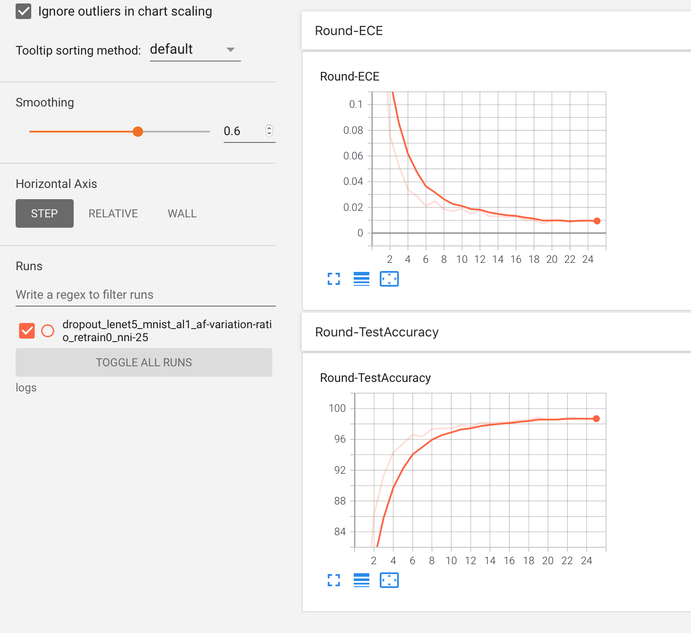

In ensemble active learning, we use 5 IID Neural networks (NNs).
There are two versions of ensemble-active learning:

1. Parallelized training: Here the training of the ensemble NNs are parallelized in such a way that the NNs run independently in different GPUs
2. Sequential training: Here the training of the ensemble NNs are performed sequentially

The Parallelized version is located inside the *beta_versions* folder and it has a few issues. So, we suggest not using it.

***Prepare the Environment***

Create your virtual python environment using pip and install the packages from ```requirements.txt```

Enable Tensorboard Visualization with the command ```tensorboard --logdir=logs```

Note:

If you are running parallelized version with GTX 1080 ti with 12GB GPU memory:
1. Set test batch size as 100
2. Set active learning batch size as 200

Folders:

plots: This contains all relevant plots. The most recent file is indicated by the version number.
trained_weights: After each round, the trained NN are stored in this folder
logs: The program uses this folder to write intermediate logs to visualize in tensorboard.
results_archive: Contains all the results in csv format

***How to run:***

The program will automatically create the following folders if not present. These folder will be created under the same directory as the program.
1. results - used to hold the final results
2. trained_weights - the path where the model stores the trained weights after each round of data acquisition. 

Examples:
1. Dropout-based active learining on a simple lenet5 model on MNIST dataset.
Here, we are running the lenet 5 model for 40 rounds, at each round we add 100 new samples to the training set (indicated by tk). We being with a
seed training sample size of 50 (indicated by -ss). During the uncertainty estimation, we will be using 25 instances of the network (indicated
by 25)

```
python TrainDropoutClassification.py -m lenet5 -mo test -bs 100 -tk 100 -ss 50 -rt 0 -r 41 -nni 25
```

2. Similarly, if you want to run the ensemble-based active leaning do:

```
python TrainEnsemble.py -m lenet5 -mo test -bs 100 -tk 100 -ss 50 -rt 0 -r 41 -nni 25
```
The meaning of command line arguments can be seen within the code (in this case TrainDropoutClassification_v3.py). You will be able to 
monitor the progress of the training using tensorboard. Currently, the program records validation accuracy and expected calibration error.
Following is an example of the tensorboard output for the above run:



Once the model has been trained, you can change the train argument in the above command to test. This will test the model on the held-out
dataset for every single round and save the output as csv. At each round, the model produces accuracy, F1, recall, expected calibration error, and support metrics for each class label. For instance, at round 40, the following is the output from the model.

|              | precision | recall | f1-score             | support              |
|--------------|-----------|--------|----------------------|----------------------|
| 0            | 0.995     | 0.992  | 0.9943963321446765   | 983.0                |
| 1            | 0.994     | 0.992  | 0.9938380281690141   | 1137.0               |
| 2            | 0.994     | 0.991  | 0.9927431059506532   | 1035.0               |
| 3            | 0.991     | 0.988  | 0.9896193771626297   | 1013.0               |
| 4            | 0.991     | 0.991  | 0.9918533604887984   | 982.0                |
| 5            | 0.985     | 0.983  | 0.9843225083986561   | 894.0                |
| 6            | 0.988     | 0.993  | 0.9911041339612768   | 953.0                |
| 7            | 0.994     | 0.992  | 0.9931972789115645   | 1030.0               |
| 8            | 0.990     | 0.987  | 0.9892362890825218   | 977.0                |
| 9            | 0.980     | 0.992  | 0.9865336658354116   | 996.0                |
| accuracy     | 0.9908    | 0.990  | 0.9908               | 0.9908               |
| macro avg    | 0.990     | 0.990  | 0.9906844080105202   | 10000.0              |
| weighted avg | 0.990     | 0.990  | 0.9908030121309157   | 10000.0              |
| ece          | 0.006     | 0.006  | 0.006706976559758134 | 0.006706976559758134 |